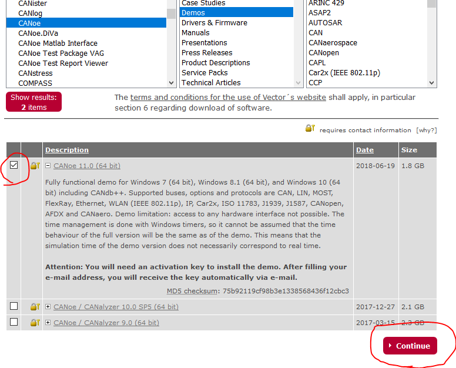

# pyxldrv

[Vector XL Driver Library][1] Wrapper for Python.

## What

- [Vector XL Driver Library][1] inlclude dlls for C/C++, C# but not for Python.
- pyxldrv wraps dlls for C/C++ as imporable library(vxlapi).
    - To wrap C/C++ dll, pyxldrv uses Cython.
    - Cython generates a library for Python("vxlapi.xxxxxx.pyd") from Cython codes(vxlapi.pxd and vxlapi.pyx).

```
import vxlapi as xl

ret = xl.OpenDriver()

...

ret = xl.CloseDriver()
```


## Installation

### CANoe

- Get XL Driver Library and Vector Driver Setup from [Vector Download-Center][2] and install them.


- If you use Windows7/8.1/10(64bit), you can use CANoe Demo version for testing.
    - Check CANoe 11.0 (64 bit)
    - Click "> Continue". Please note that it requires "contact information".




## Cython and build tool

- Get Cython via pip at first.

- For Python 3.6
    - Get [Build Tools for Visual Studio 2017](https://www.visualstudio.com/ja/downloads).


## build command

```
python setup.py build_ext -i --compiler=msvc
```

setup.py supports only for 64bit version but you can use

## basic test

```
python -m unittest tests.test_basic
```

## License

## ref
- https://blog.ymyzk.com/2014/11/setuptools-cython/
- https://blog.ymyzk.com/2014/11/setuptools-cython/
- http://qh73xebitbucketorg.readthedocs.io/ja/latest/1.Programmings/python/LIB/cython/wrapperforcpp/
- https://vector.com/vi_xl_driver_library_en.html

<!--Reference-->
[1]:https://vector.com/vi_xl_driver_library_en.html
[2]:https://vector.com/vi_downloadcenter_en.html
[3]:https://vector.com/vi_vn1600_en.html
[4]:https://vector.com/vi_canoe_en.html
