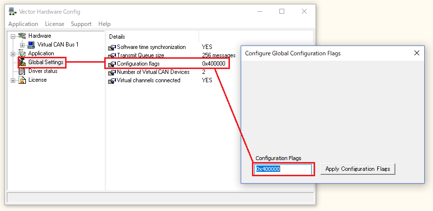
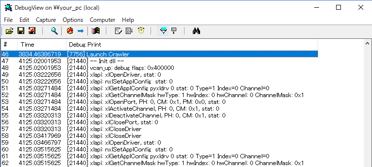

# pyxldrv

[Vector XL Driver Library][1] Wrapper for Python.

## What

- [Vector XL Driver Library][1] inlclude dlls for C/C++, C# but not for Python.
- pyxldrv makes the dll for C/C++ an importable library(vxlapi).
    - To wrap C/C++ dll, pyxldrv uses Cython.
    - Cython generates a library for Python("vxlapi.xxxxxx.pyd") from Cython codes(vxlapi.pxd and vxlapi.pyx).

```
import vxlapi as xl

ret = xl.OpenDriver()
....
msgs = []
msgs.append({"flags":0, "id":0x321, "dlc":8, "data":bytearray([0x12,0x34,0x56,0x78,0x9A,0xBC,0xDE,0xF0])})
message_count = [len(msgs)]
status = xl.CanTransmit(portHandle[0], accessMask, message_count, msgs)
...
ret = xl.CloseDriver()
```

- and there is an additional wrapper class for CAN(can.py).

## Installation

### CANoe

- Get XL Driver Library and Vector Driver Setup from [Vector Download-Center][2] and install them.


<!-- - If you use Windows7/8.1/10(64bit), you can use CANoe Demo version for testing.
    - Check CANoe 11.0 (64 bit)
    - Click "> Continue". Please note that it requires "contact information".

 -->


## Cython and build tool

- Get Cython via pip at first.

- For Python 3.6
    - Get [Build Tools for Visual Studio 2017](https://www.visualstudio.com/ja/downloads).

## Support APIs

### Common Commands

|name|support|remark|
|:---|:---|:---|
|xlOpenDriver|yes||
|xlCloseDriver|yes||
|xlGetApplConfig|yes||
|xlSetApplConfig|yes|||
|xlGetDriverConfig|yes|||
|xlGetRemoteDriverConfig|yes|not tested.|
|xlGetChannelIndex|yes|not tested.|
|xlGetChannelMask|yes||
|xlOpenPort|yes||
|xlClosePort|yes||
|xlSetTimerRate|yes|not tested.|
|xlSetTimerRateAndChannel|yes|not tested.|
|xlResetClock|yes|not tested.|
|xlSetNotification|yes||
|xlFlushReceiveQueue|yes|not tested.|
|xlGetReceiveQueueLevel|yes|not tested.|
|xlActivateChannel|yes||
|xlReceive|yes||
|xlGetEventString|yes|xlReceive and xlGetEventString are intergrated into vxlapi.Receive.|
|xlGetErrorString|yes||
|xlGetSyncTime|yes|not tested.|
|xlGetChannelTime|yes|not tested.|
|xlGenerateSyncPulse|yes|not tested.|
|xlPopupHwConfig|yes||
|xlDeactivateChannel|yes||
|xlGetLicenseInfo|yes|not tested.|
|xlSetGlobalTimeSync|yes|not tested.|
|xlGetKeymanBoxes|yes|not tested.|
|xlGetKeymanInfo|yes|not tested.|

### CAN Commands

|name|support|remark|
|:---|:---|:---|
|xlCanSetChannelMode|yes|not tested.|
|xlCanSetChannelOutput|yes|not tested.|
|xlCanSetReceiveMode|yes|not tested.|
|xlCanSetChannelTransceiver|yes|not tested.|
|xlCanSetChannelParams|yes|not tested.|
|xlCanSetChannelParamsC200|yes|not tested.|
|xlCanSetChannelBitrate|yes||
|xlCanSetChannelAcceptance|yes|not tested.|
|xlCanAddAcceptanceRange|yes|not tested.|
|xlCanRemoveAcceptanceRange|yes|not tested.
|xlCanResetAcceptance|yes|not tested.
|xlCanRequestChipState|yes|not tested.|
|xlCanTransmit|yes||
|xlCanFlushTransmitQueue|yes|not tested.|

### CAN FD Commands

|name|support|remark|
|:---|:---|:---|
|xlCanFdSetConfiguration|yes|not tested.|
|xlCanTransmitEx|yes|not tested.|
|xlCanReceive|no||
|xlCanGetEventString|no||

### LIN Commands

to be suported. 3rd

### Ethernet Commands

to be suported. 4th

### Other Commands(MOST, FlexRay, AR429, ...)

not to be supported at this moment.


## DebugView for Windows

For debugging vxlapi.pyx, [DebugView for Windows](https://technet.microsoft.com/en-us/sysinternals/debugview.aspx) can be used. Because DebugView for Windows shows native side(vxlapi.dll) function's status, "debug print" can be reduced.

See XL Driver Library - Description.pdf

> ### 2.5 Additional Information
> The XL Driver Library supports debug prints which can be enabled in the Vector
Hardware Configuration tool. In section General information, select Settings and
double-click on Configuration flags. Enter the required flag (see table below). To
activate the flags, restart the PC.

|Flags|Supported Bus Type|
|:---|:---|
|0x400000|CAN, LIN, DAIO|
|0x002000|MOST|
|0x010000|FlexRay|






## build command

```
python setup.py build_ext -i --compiler=msvc
```

setup.py supports only for 64bit version but you can use

## basic test

```
python -m unittest tests.test_basic
```

## License

## ref
- https://blog.ymyzk.com/2014/11/setuptools-cython/
- https://blog.ymyzk.com/2014/11/setuptools-cython/
- http://qh73xebitbucketorg.readthedocs.io/ja/latest/1.Programmings/python/LIB/cython/wrapperforcpp/
- https://vector.com/vi_xl_driver_library_en.html

<!--Reference-->
[1]:https://vector.com/vi_xl_driver_library_en.html
[2]:https://vector.com/vi_downloadcenter_en.html
[3]:https://vector.com/vi_vn1600_en.html
[4]:https://vector.com/vi_canoe_en.html
